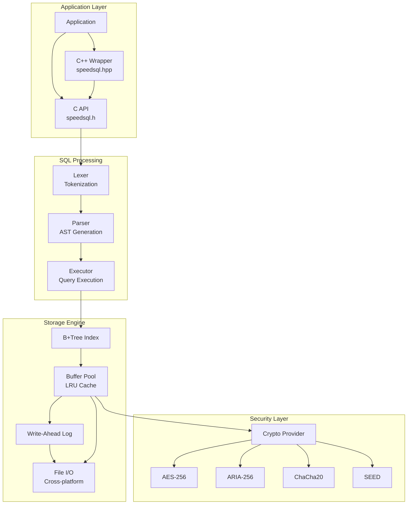
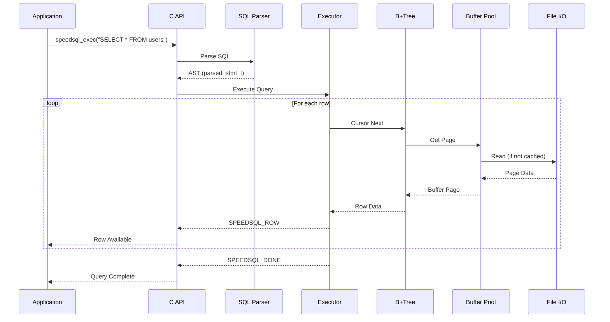
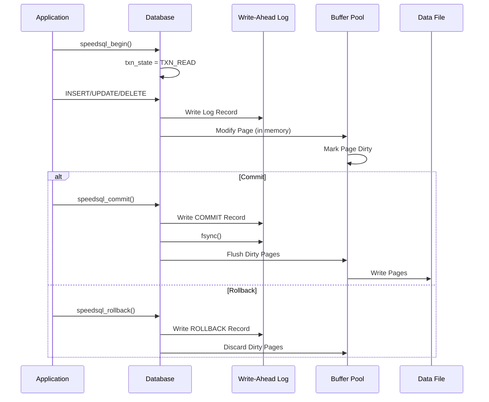
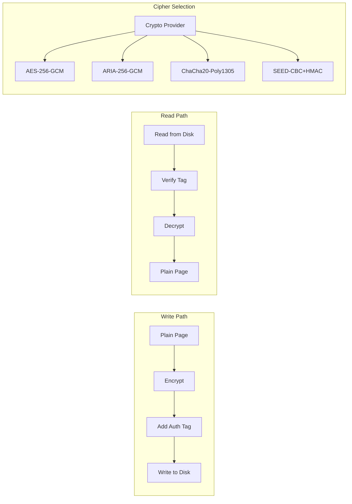

# SpeedSQL

[](https://github.com/kjm99d/SpeedSQL/actions)
[](LICENSE)
[](https://isocpp.org/)
[]()

Ultra-fast file-based local database engine designed to overcome SQLite's limitations.

## Features

### Core Features
- **High Performance**: 16KB page size (vs SQLite's 4KB), optimized buffer pool with LRU eviction
- **Large Data Support**: 64-bit page addressing for TB-scale databases
- **Concurrent Access**: Read-write locks for better multi-threaded performance
- **SQL Compatible**: Standard SQL syntax support (SELECT, INSERT, UPDATE, DELETE, CREATE TABLE)
- **ACID Transactions**: Write-Ahead Logging (WAL) for crash recovery

### Modern Features
- **JSON Support**: Native JSON data type with path queries
- **Vector Search**: Built-in vector similarity search for AI/ML applications
- **Full-Text Search**: Integrated FTS capabilities

### Security & Encryption (CC Certified Ready)
- **Multiple Cipher Support**: Pluggable encryption architecture
- **AES-256-GCM**: NIST standard, hardware acceleration ready
- **ARIA-256-GCM**: Korean national standard (KS X 1213), CC certified
- **SEED-CBC**: Korean standard cipher (TTAS.KO-12.0004)
- **ChaCha20-Poly1305**: Modern stream cipher, fast in software
- **No Encryption**: Optional plaintext mode for development

## SQLite Limitations Addressed

| Limitation | SQLite | SpeedSQL |
|------------|--------|----------|
| Page Size | 4KB fixed | 16KB default, configurable |
| Max File Size | 281TB (theoretical) | Unlimited (64-bit addressing) |
| Concurrent Writes | Single writer | Optimized locking |
| Cache Size | Limited | 256MB default, up to 8GB |
| Modern Types | Limited | JSON, Vector native support |

## Building

### Requirements
- CMake 3.16+
- C++17 compatible compiler
- Windows: MSVC 2019+ or MinGW
- Linux/macOS: GCC 8+ or Clang 10+

### Build Commands

```bash
# Create build directory
mkdir build && cd build

# Configure
cmake ..

# Build
cmake --build . --config Release
```

### Build Options

```bash
cmake .. \
    -DSPEEDSQL_BUILD_SHARED=ON \
    -DSPEEDSQL_BUILD_STATIC=ON \
    -DSPEEDSQL_BUILD_TESTS=ON \
    -DSPEEDSQL_BUILD_EXAMPLES=ON \
    -DSPEEDSQL_BUILD_BENCHMARK=OFF
```

## Testing

SpeedSQL includes a comprehensive test suite covering core functionality, SQL parsing, database operations, encryption, and v1.0 integration features.

### Test Categories

| Category | Tests | Description |
|----------|-------|-------------|
| Value Tests | 7 | Data type operations (null, int, float, text, copy, compare) |
| Hash Tests | 2 | CRC32, xxHash64 hash functions |
| Lexer Tests | 4 | SQL tokenization (keywords, strings, numbers, operators) |
| Parser Tests | 13 | SQL parsing (SELECT, INSERT, UPDATE, DELETE, CREATE, DROP, BEGIN) |
| Database API Tests | 5 | Core API (open/close, exec, prepared statements, transactions) |
| Savepoint Tests | 2 | Transaction savepoints (API and SQL syntax) |
| Index Tests | 3 | CREATE INDEX, UNIQUE INDEX, DROP INDEX |
| Encryption Tests | 3 | Crypto status, key setting, cipher configuration |
| V1.0 Integration Tests | 9 | UPDATE/DELETE WHERE, ORDER BY, LIMIT, aggregates, JOIN, DROP TABLE |

**Total: 46 tests**

### Running Tests

#### Windows (CMake + Ninja/MinGW)

```bash
# Navigate to project directory
cd D:\Projects\SpeedDB

# Clean build and configure
rm -rf build
mkdir build && cd build
cmake .. -DCMAKE_BUILD_TYPE=Release

# Build with Ninja (default on Windows with MinGW)
ninja

# Run test executable
./bin/speedsql_test.exe
```

#### Windows (CMake + Visual Studio)

```bash
# Configure with Visual Studio generator
cmake .. -G "Visual Studio 17 2022" -A x64

# Build
cmake --build . --config Release

# Run tests
.\Release\speedsql_test.exe
# or use CTest
ctest -C Release --output-on-failure
```

#### Linux / WSL

```bash
# Navigate to project directory
cd /path/to/SpeedDB

# Option 1: Using CMake
mkdir build && cd build
cmake .. -DCMAKE_BUILD_TYPE=Release
make -j$(nproc)
./bin/speedsql_test

# Option 2: Direct compilation (quick testing)
g++ -std=c++17 -O2 -I include -o test_linux \
    tests/test_main.cpp \
    src/util/hash.cpp \
    src/util/value.cpp \
    src/storage/file_io.cpp \
    src/storage/buffer_pool.cpp \
    src/storage/wal.cpp \
    src/index/btree.cpp \
    src/sql/lexer.cpp \
    src/sql/parser.cpp \
    src/core/database.cpp \
    src/core/executor.cpp \
    src/crypto/crypto_provider.cpp \
    src/crypto/cipher_none.cpp \
    src/crypto/cipher_aes.cpp \
    src/crypto/cipher_aria.cpp \
    src/crypto/cipher_seed.cpp \
    src/crypto/cipher_chacha20.cpp \
    -lpthread

./test_linux
```

#### macOS

```bash
# Using CMake
mkdir build && cd build
cmake .. -DCMAKE_BUILD_TYPE=Release
make -j$(sysctl -n hw.ncpu)
./bin/speedsql_test
```

### Expected Output

```
SpeedSQL Test Suite
===================

Value Tests:
Running value_null... PASSED
Running value_int... PASSED
Running value_float... PASSED
Running value_text... PASSED
Running value_copy... PASSED
Running value_compare_int... PASSED
Running value_compare_text... PASSED

Hash Tests:
Running crc32_basic... PASSED
Running xxhash64_basic... PASSED

Lexer Tests:
Running lexer_select... PASSED
Running lexer_string... PASSED
Running lexer_numbers... PASSED
Running lexer_operators... PASSED

Parser Tests:
Running parser_select_simple... PASSED
Running parser_select_columns... PASSED
Running parser_select_where... PASSED
Running parser_insert... PASSED
Running parser_update... PASSED
Running parser_delete... PASSED
Running parser_create_table... PASSED
Running parser_create_index... PASSED
Running parser_create_unique_index... PASSED
Running parser_begin... PASSED
Running parser_drop_table... PASSED

Database API Tests:
Running db_open_close... PASSED
Running db_exec_create_table... PASSED
Running db_exec_insert_select... PASSED
Running db_prepared_stmt... PASSED
Running db_transaction... PASSED

Savepoint Tests:
Running savepoint_api_basic... PASSED
Running savepoint_sql_syntax... PASSED

Index Tests:
Running index_create... PASSED
Running index_unique... PASSED
Running index_drop... PASSED

Encryption Tests:
Running crypto_status... PASSED
Running crypto_key_set... PASSED
Running crypto_v2_api... PASSED

V1.0 Integration Tests:
Running integration_update_where... PASSED
Running integration_delete_where... PASSED
Running integration_order_by... PASSED
Running integration_limit_offset... PASSED
Running integration_aggregates... PASSED
Running integration_join... PASSED
Running integration_drop_table... PASSED
Running integration_transaction_commit... PASSED
Running integration_transaction_rollback... PASSED

===================
Results: 46 passed, 0 failed
```

### Cross-Platform Verification

SpeedSQL is tested on both Windows and Linux to ensure cross-platform compatibility:

| Platform | Compiler | Status |
|----------|----------|--------|
| Windows 10/11 | MinGW GCC 15.2 | ✅ 46/46 passed |
| Windows 10/11 | MSVC 2022 | ✅ Supported |
| Linux (Ubuntu/WSL) | GCC 11+ | ✅ 46/46 passed |
| macOS | Clang 14+ | ✅ Supported |

### Troubleshooting

#### CMake not found (Linux/WSL)
```bash
sudo apt-get update
sudo apt-get install cmake build-essential
```

#### Ninja not found (Windows)
```bash
# Install via winget
winget install Ninja-build.Ninja

# Or use MSYS2
pacman -S mingw-w64-x86_64-ninja
```

#### Build fails with C++17 errors
Ensure your compiler supports C++17:
```bash
# Check GCC version (need 8+)
g++ --version

# Check Clang version (need 10+)
clang++ --version
```

## Usage

### C API

```c
#include "speedsql.h"

int main() {
    speedsql* db;

    // Open database
    speedsql_open("mydata.sdb", &db);

    // Create table
    speedsql_exec(db,
        "CREATE TABLE users (id INTEGER PRIMARY KEY, name TEXT, age INTEGER)",
        NULL, NULL, NULL);

    // Insert data
    speedsql_exec(db,
        "INSERT INTO users VALUES (1, 'Alice', 30)",
        NULL, NULL, NULL);

    // Query with prepared statement
    speedsql_stmt* stmt;
    speedsql_prepare(db, "SELECT * FROM users WHERE age > ?", -1, &stmt, NULL);
    speedsql_bind_int(stmt, 1, 25);

    while (speedsql_step(stmt) == SPEEDSQL_ROW) {
        int id = speedsql_column_int(stmt, 0);
        const char* name = (const char*)speedsql_column_text(stmt, 1);
        printf("User: %d - %s\n", id, name);
    }

    speedsql_finalize(stmt);
    speedsql_close(db);

    return 0;
}
```

### C++ Wrapper

```cpp
#include "speedsql.hpp"
using namespace speedsql;

int main() {
    Database db("mydata.sdb");

    db.exec("CREATE TABLE users (id INTEGER, name TEXT, age INTEGER)");
    db.exec("INSERT INTO users VALUES (1, 'Alice', 30)");

    // RAII Transaction
    db.transaction([&]() {
        db.exec("UPDATE users SET age = 31 WHERE id = 1");
    });

    // Range-based for loop
    for (auto& row : db.query("SELECT * FROM users WHERE age > ?", 25)) {
        std::cout << std::get<std::string>(row[1]) << "\n";
    }

    return 0;
}
```

### Transactions

```c
speedsql_begin(db);

int rc = speedsql_exec(db, "UPDATE accounts SET balance = balance - 100 WHERE id = 1", NULL, NULL, NULL);
if (rc == SPEEDSQL_OK) {
    rc = speedsql_exec(db, "UPDATE accounts SET balance = balance + 100 WHERE id = 2", NULL, NULL, NULL);
}

if (rc == SPEEDSQL_OK) {
    speedsql_commit(db);
} else {
    speedsql_rollback(db);
}
```

### Encryption

```c
#include "speedsql.h"
#include "speedsql_crypto.h"

int main() {
    speedsql* db;

    // Open database
    speedsql_open("secure.sdb", &db);

    // Configure encryption
    speedsql_crypto_config_t config = {
        .cipher = SPEEDSQL_CIPHER_AES_256_GCM,  // or ARIA_256_GCM for Korean CC
        .kdf = SPEEDSQL_KDF_PBKDF2_SHA256,
        .kdf_iterations = 100000
    };

    // Set encryption key
    speedsql_key_v2(db, "my_password", 11, &config);

    // Use database normally - encryption is transparent
    speedsql_exec(db, "CREATE TABLE secrets (id INTEGER, data TEXT)", NULL, NULL, NULL);

    speedsql_close(db);
    return 0;
}
```

### Supported Ciphers

| Cipher | Key Size | Mode | Use Case |
|--------|----------|------|----------|
| `SPEEDSQL_CIPHER_NONE` | - | - | Development, testing |
| `SPEEDSQL_CIPHER_AES_256_GCM` | 256-bit | AEAD | General use, NIST compliant |
| `SPEEDSQL_CIPHER_AES_256_CBC` | 256-bit | CBC+HMAC | Legacy compatibility |
| `SPEEDSQL_CIPHER_ARIA_256_GCM` | 256-bit | AEAD | Korean CC certification |
| `SPEEDSQL_CIPHER_SEED_CBC` | 128-bit | CBC | Korean legacy systems |
| `SPEEDSQL_CIPHER_CHACHA20_POLY1305` | 256-bit | AEAD | Mobile, software-only |

## Architecture

### System Overview



### Query Execution Flow



### Transaction & WAL Flow



### Page Encryption Flow



### Directory Structure

```
SpeedSQL/
├── include/
│   ├── speedsql.h           # Public C API
│   ├── speedsql.hpp         # Modern C++ wrapper
│   ├── speedsql_crypto.h    # Encryption API
│   ├── speedsql_types.h     # Type definitions
│   └── speedsql_internal.h  # Internal structures
├── src/
│   ├── core/
│   │   ├── database.cpp     # Connection management
│   │   └── executor.cpp     # Query executor
│   ├── storage/
│   │   ├── file_io.cpp      # Cross-platform file I/O
│   │   ├── buffer_pool.cpp  # Page cache (LRU)
│   │   └── wal.cpp          # Write-ahead logging
│   ├── index/
│   │   └── btree.cpp        # B+Tree implementation
│   ├── sql/
│   │   ├── lexer.cpp        # SQL tokenizer
│   │   └── parser.cpp       # SQL parser
│   ├── crypto/
│   │   ├── crypto_provider.cpp  # Cipher registry
│   │   ├── cipher_none.cpp      # No encryption
│   │   ├── cipher_aes.cpp       # AES-256-GCM/CBC
│   │   ├── cipher_aria.cpp      # ARIA-256 (Korean)
│   │   ├── cipher_seed.cpp      # SEED (Korean)
│   │   └── cipher_chacha20.cpp  # ChaCha20-Poly1305
│   └── util/
│       ├── hash.cpp         # CRC32, xxHash64
│       └── value.cpp        # Value operations
├── tests/
│   └── test_main.cpp        # Test suite (46 tests)
├── examples/
│   ├── basic_usage.cpp
│   ├── encryption_example.cpp
│   └── cpp_wrapper_example.cpp
└── benchmark/
```

## Design Principles (SOLID)

- **Single Responsibility**: Each module handles one concern (storage, indexing, parsing)
- **Open/Closed**: Extensible through interfaces (compare functions, hash functions)
- **Liskov Substitution**: Value types are interchangeable where appropriate
- **Interface Segregation**: Separate public API from internal interfaces
- **Dependency Inversion**: High-level modules depend on abstractions

## Performance Targets

- **Point Query**: < 10 microseconds
- **Range Scan**: > 1M rows/second
- **Bulk Insert**: > 100K rows/second
- **Concurrent Reads**: Linear scaling with threads

## Roadmap

### v0.1
- [x] Project structure
- [x] File I/O layer
- [x] Buffer pool / page cache
- [x] B+Tree index (basic)
- [x] SQL lexer & parser
- [x] Encryption module (AES, ARIA, SEED, ChaCha20)
- [x] Modern C++ wrapper
- [x] Query executor (prepare/step/finalize, bind, column access)
- [x] Schema management (CREATE TABLE, table catalog)
- [x] B+Tree page splits (leaf & internal nodes, root promotion)
- [x] WAL implementation (write, commit, rollback, recover, checkpoint)
- [x] AES-256-CBC / ARIA-256-CBC modes with HMAC authentication
- [x] CREATE INDEX parsing
- [x] Encryption key API (speedsql_key, speedsql_key_v2, speedsql_rekey)

### v1.0 (Current)
- [x] UPDATE statement execution with WHERE filtering
- [x] DELETE statement execution with WHERE filtering
- [x] DROP TABLE / DROP INDEX execution
- [x] CREATE INDEX execution
- [x] ORDER BY clause with result buffering and sorting
- [x] LIMIT / OFFSET pagination support
- [x] Aggregate functions (COUNT, SUM, AVG, MIN, MAX)
- [x] GROUP BY / HAVING clause parsing
- [x] JOIN support (INNER, LEFT, RIGHT, CROSS)
- [x] Schema persistence for file-based databases
- [x] Full transaction support (nested transactions, savepoints)
- [x] Page-level encryption integration
- [x] Secondary index execution (index scan)

### v2.0
- [ ] Query optimizer (cost-based)
- [ ] Hash join for large tables
- [ ] JSON functions
- [ ] CC certification preparation
- [ ] Vector search
- [ ] Full-text search
- [ ] Compression

## License

MIT License

## Contributing

Contributions are welcome! Please read our contributing guidelines before submitting PRs.
